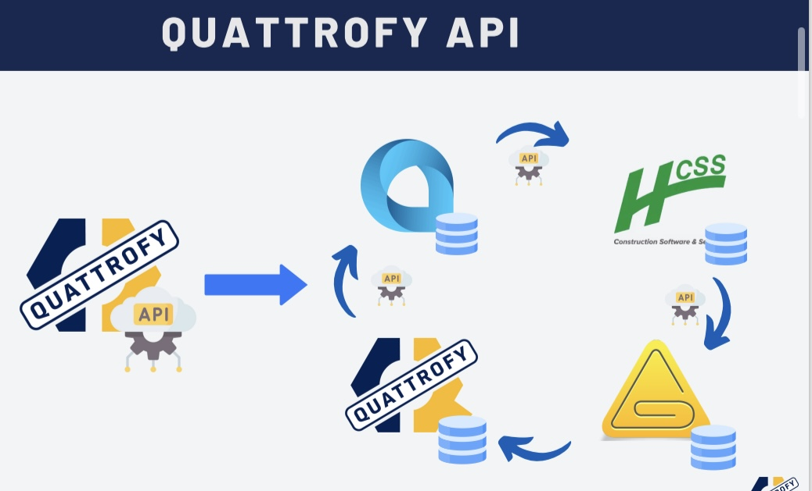

# 🔌 Quattrofy API

## 🧭 Overview  
**Quattrofy API** is a secure, internal RESTful API designed to enable seamless integration between the **Quattrofy Web Application** and tools such as **Microsoft Power Automate**, **Microsoft Copilot Studio**, and future internal systems. It serves as the foundation for data automation, smart queries, and actionable insights across Quattro Constructors' operational environment.

---

## 💡 Idea & Concept  
The goal was to build a **centralized API layer** for securely exposing business logic and data from the Quattrofy system.  
It empowers automation, real-time querying, and task execution using tools like Power Automate and conversational agents like QuattroMan.

---

### Flow

---

## ✨ Key Endpoints  
Some of the most commonly used and critical endpoints include:

- `/employees/location` – Return current or last known location of an employee  
- `/equipment/location` – Return last registered project or location for an asset  
- `/projects/summary` – Returns general information about project status, start, cost, team, etc.  
- `/projects/payclasses` – Retrieves pay class information for a specific project  
- `/projects/sync` – Performs secure sync operation between external and Quattrofy databases  
- `/system/ping` – Used for availability checks before automated flows run  

---

## ⚙️ Tech Stack  
| **Category**             | **Tools & Technologies** |
|--------------------------|--------------------------|
| **Backend**              |  |
| **Data Format**          |  |
| **Framework**            |  |
| **Database**             |   |
| **Cloud & Hosting**      |    |
| **APIs & Integrations**  |      |
| **API Protocols**        |  |
| **Analytics & BI**       |  |
| **DevOps & Version Control** |    |
| **Project Management**   |  |
| **Security & Identity**  |  `Used for secure token-based authentication` |

---

## 🧑‍💻 My Role & Contributions  
- Designed and implemented the full API architecture  
- Developed all core endpoints using C# and .NET Core  
- Secured access using role-based authentication and JWT tokens  
- Built automation hooks for Power Automate triggers  
- Connected endpoints with Microsoft Copilot Studio for dynamic AI conversations  
- Deployed API with versioning and performance logging  

---

## 🔐 Security Highlights  
- JWT token validation with expiration  
- HTTPS-only access  
- Role-based access controls  
- IP whitelisting (for high-privilege endpoints)  
- Detailed logging with internal analytics  

---

## 📈 Future Enhancements  
- Swagger documentation for all endpoints  
- GraphQL gateway for more flexible frontend consumption  
- Activity logs with real-time alerts  
- Rate limiting and throttling for abuse protection  

---

## 🔗 Related Projects  
- [Quattrofy Web](#) – The main system interfacing with this API  
- [QuattroMan](#) – AI Assistant using this API for smart queries  
- [Power Automate Flows](#) – Automations triggered via this API  

---

## 📎 License  
Internal use only – Proprietary API for **Quattro Constructors**. Not open to the public.
